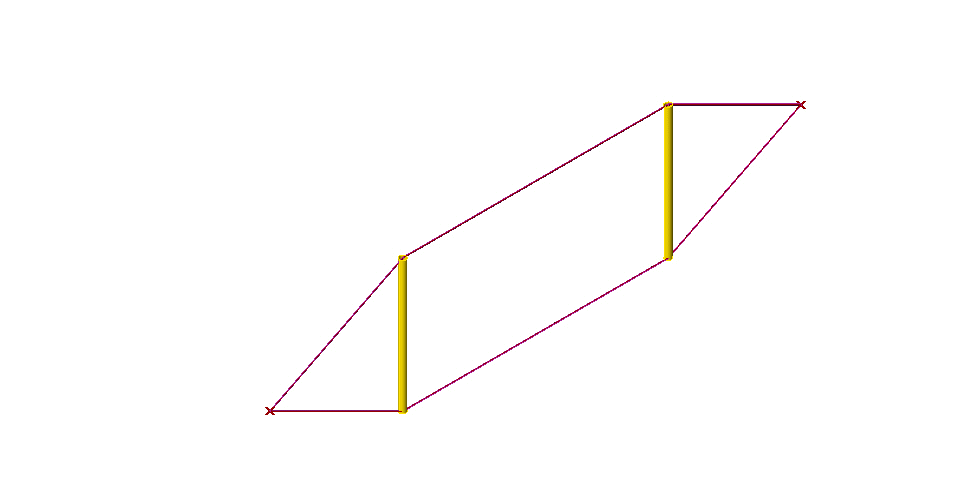
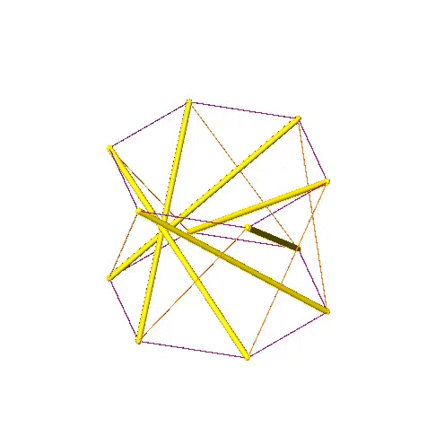
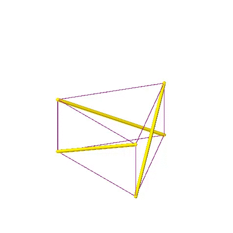

# tensegrity_structures

Studies of self-tensioning structures

## About

Studies of self-tensioning structures composed of rigid structures and cables, with forces of traction and compression, that form an integrated whole.

---

# Arch models

---
### Simple truss 

---

# Basic models

---

### Tensegrity 06

---

### Tensegrity 03

---

### Tensegrity...

...

---

## References

under construction..

